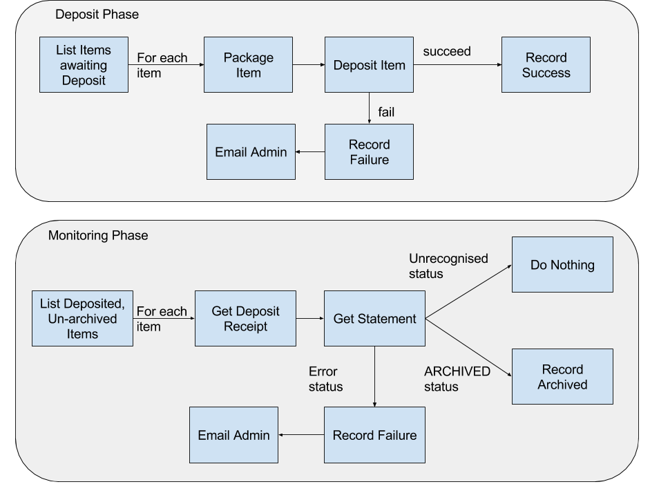
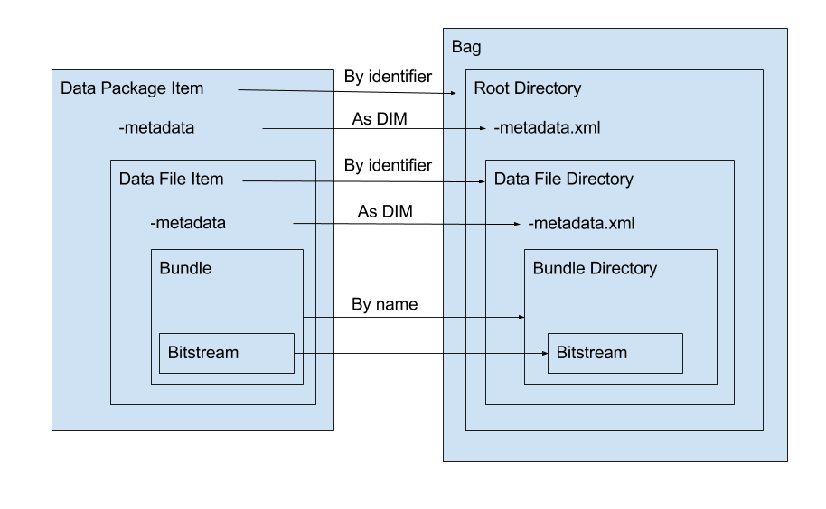
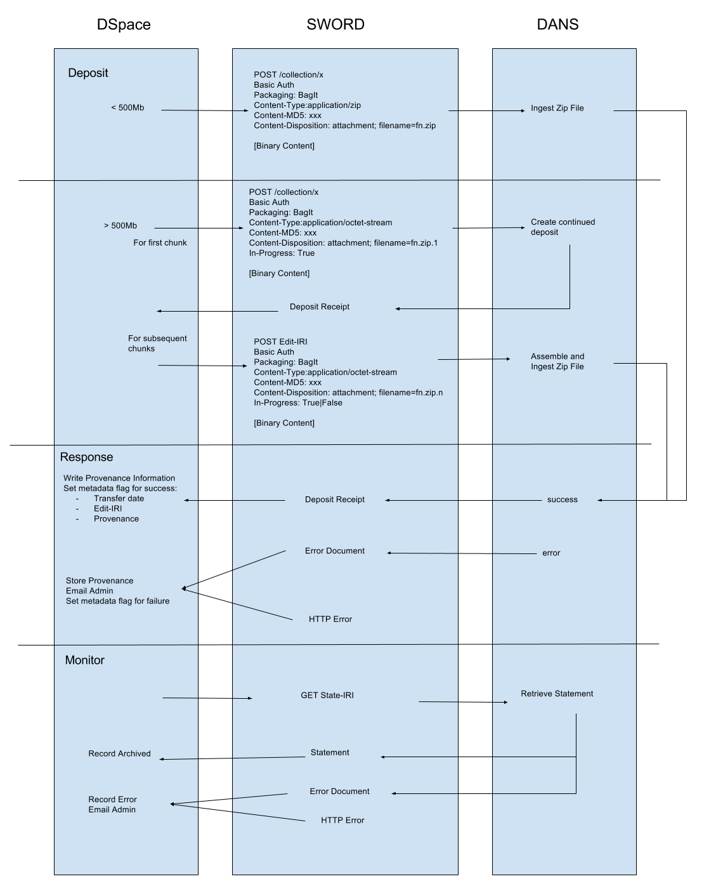

# System Architecture and Behaviours

This module consists of a number of important features which enable the transfer of data from Dryad to DANS:

* The conversion of Dryad Items to DANS packages
* The use of the DANS SWORDv2 deposit procedures
* The management and workflow of the Drayd Data Packages that are sent to DANS

This document describes the various parts and how they function

## Overview of Workflow

The overall workflow is done in two phases:

1. A deposit phase, where the items are packaged and sent to DANS
2. A monitoring phase, where the deposited items are monitored for success or failure during processing by DANS

The diagram below shows the main events in each of these phases:

## Dryad Data Package Metadata

In order to control the deposit to DANS, there are 5 metadata fields that can be attached to a Data Package that allow
us to determine its state with regard to that deposit:
 
| Field         | Meaning       |
| ------------- | ------------- |
| dryad.dansTransferDate  | The date an item was successfully transferred to DANS.  This does not mean that an item was successfully archived. |
| dryad.dansEditIRI  | The Edit-IRI from the SWORDv2 deposit.  This is a URL from which information about the item can be retrieved. |
| dryad.dansTransferFailed  | The date an item failed to be transferred to DANS. |
| dryad.dansProcessingFailed  | The date an item was that had previously been successfully transferred to DANS failed to process |
| dryad.dansArchiveDate  | The date an item was successfully archived in DANS. |

In addition, the module writes to dc.description.provenance when there is more human-readable information available.

With reference to the above workflow overview diagram, the following metadata fields are written at the various stages:

| Phase | Stage | Fields |
| ----- | ----- | ------ |
| Deposit | Record Success | dryad.dansTransferDate, dryad.dansEditIRI, dc.description.provenance |
| Deposit | Record Failure | dryad.dansTransferFailed, dc.description.provenance |
| Monitoring | Record Archived | dryad.dansArchiveDate, dc.description.provenance |
| Monitoring | Record Failure | dryad.dansProcessingFailed, dc.description.provenance |

So, consider the following examples:

**An item which has successfully transferred to DANS and been archived**

    dryad.dansTransferDate = 2017-01-01T00:00:00Z
    dryad.dansEditIRI = https://act.easy.dans.knaw.nl/sword2/container/xxxxxx
    dryad.dansArchiveDate = 2017-01-01T01:00:00Z

**An item which has successfully transferred to DANS but failed in processing**

    dryad.dansTransferDate = 2017-01-01T00:00:00Z
    dryad.dansEditIRI = https://act.easy.dans.knaw.nl/sword2/container/xxxxxx
    dryad.dansProcessingFailed = 2017-01-01T01:00:00Z
    
**An item which has successfully transferred to DANS, and is awaiting processing**

    dryad.dansTransferDate = 2017-01-01T00:00:00Z
    dryad.dansEditIRI = https://act.easy.dans.knaw.nl/sword2/container/xxxxxx

**An item which failed to transfer to DANS**

    dryad.dansTransferFailed = 2017-01-01T00:00:00Z

## Iterators

In order to control which items are acted upon, several iterators are used which selectively present items for processing.

The iterators are as follows:

### Transfer Iterator

This lists all items which are due to be transferred to DANS.  Its critera are:

1. That the item does not have the dryad.dansTransferDate metadata

The consequences of this iterator are that all items which have not previously been successfully transferred to DANS
are included.  This includes items which have the dryad.dansTransferFailed metadata, so any items which fail to transfer
will be tried again on the next run.

### Monitor Iterator

This lists all the items which need to be monitored in DANS until they reach their archived state, or experience a processing error.  It criteria are:

1. That the item has the dryad.dansTransferDate metadata
2. That the item does not have the dryad.dansArchiveDate metadata
3. That the item does not have the dryad.dansProcessingFailed metadata

The consequences of this iterator are that all items which have been successfully transferred to DANS but have not yet been
archived or experienced processing errors are included.  Once an item has been archived or has had an error, it will no longer
be included.

## Packaging and Crosswalks

This module maps Dryad Data Packages and their Data Files into the DANS BagIt format.  The mapping is as follows

The identifier of the Data Package forms the top level directory of the bag, inside which is the standard "data" directory
as per the BagIt spec.  The metadata is expressed in the DSpace Internal Metadata (DIM) format and inserted in the data directory.  
Then each data file is given a directory based on its identifier, and in turn its metadata is inserted there in the DIM format.  
Bundles in the Data Files are given directories, and bitstreams are mapped to the corresponding bundle directory.

Additionally, at the top level directory of the bag there are a number of tagfiles.  See the [dans-bagit](https://github.com/datadryad/dans-bagit) library
for more information on that.

There are 2 metadata crosswalks involved in creating the bag:

### DIM

The DIM is a simple metadata format used by DSpace to express its internal metadata storage.  It is expressed thus:

    <dim:field mdschema="dc" element="contributor" qualifier="author">A.N. Other</dim:field>
    
To convert the Data Package or Data File metadata to this format we do a straight mapping from the DSpace Item metadata
to this XML format.

### DDM

DDM is the DANS metadata format, and the documentation for this can be found at https://github.com/DANS-KNAW/easy-sword2-dans-examples

The Dryad mapping to that format is simple, and can be found in this file: https://github.com/datadryad/dryad2dans/blob/master/src/main/java/org/datadryad/dans/DDMXWalk.java#L16

## SWORDv2 Protocol Operations

The diagram below shows all of the protocol operations in use by this module:

The following sections give a little more detail and explanation of each of these stages

### Initial Deposit

There are two possible scenarios for the initial deposit:

1. Where the total package size is below some threshold (e.g. 500Mb)
2. Where the total package size is above that threshold

In the first case, we carry out a standard create operation, by POSTing the binary content with the relevant headers to the
Collection.

In the second case, instead we chunk the file into segments no larger than the threshold.  The first of these chunks we
send by POST to the Collection with the header In-Progress: True, and with the file name "filename.zip.1".  This tells
DANS that we are entering into a continued deposit process.

For all remaining segments, we POST to the Edit-IRI received in the Deposit Receipt from the first operation.  We increment the
number on the end of the zip file by 1 each time (e.g. filename.zip.2, filename.zip.3, etc).  For all chunks except the last
one we use In-Progress: True.  When we send the final chunk we also send In-Progress: False; this tells DANS that we have
sent all the data, and they can begin processing.

### Response

For any of these operations, a successful deposit will result in a Deposit Receipt, and we can record the metadata as 
described in the above section.  Likewise, in the case of an error, the metadata is updated accordingly.

### Monitor

When a record has been successfully transferred to DANS, it becomes available for monitoring (see above on Iterators).

We retrieve the Statement for the item (which can be got from the Deposit Receipt, for which we have the Edit-IRI), and
depending on the status of the item, we record the metadata on the item's state.